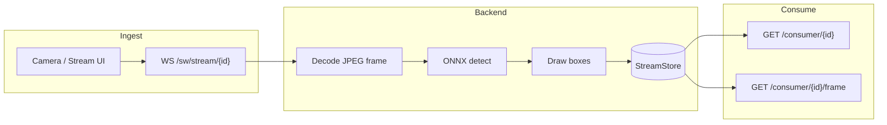

# Guardian — Developer guide

Orientation for humans running and changing the Guardian stack (weapon-detection POC: ingest → ONNX → dashboards / streams).

## What this repo is

- **Backend**: FastAPI + Uvicorn (HTTPS in Docker by default), ONNX Runtime + OpenCV for YOLO-style detection, in-memory frame store, WebSocket producer and MJPEG consumer routes.
- **Frontend**: Vite + React + TypeScript + Tailwind v4, mock-or-backend data layer, no React Router (view state in `App.tsx`).
- **Ops**: Docker Compose for backend (and optional full stack), nginx in the production frontend image proxying `/api`, `/sw`, `/consumer`, `/health` to the backend.

## Repository layout

```
GUARDIAN/
├── backend/           # Python service (main.py, Dockerfile, entrypoint TLS)
├── frontend/
│   ├── app/           # Vite React app (all UI source)
│   └── AGENT.md       # Frontend-specific agent notes
├── trained_model/     # ONNX model path expected by backend
├── docker-compose.yml # Production-style stack
├── docker-compose.dev.yml
└── scripts/           # docker-up helpers
```

## Architecture (data flow)



- **Producer contract**: WebSocket messages should be **decodable image bytes** (e.g. JPEG/PNG). The backend uses `cv2.imdecode`; arbitrary **MediaRecorder WebM chunks** are not valid single frames without a different pipeline.
- **Consumer contract**: `GET /consumer/{stream_id}` returns **multipart MJPEG** (`multipart/x-mixed-replace; boundary=frame`). The **same** `stream_id` must be used on the producer and when registering cameras in the UI.

## Local development

### Backend

From `backend/` (see `backend/AGENT.md`):

- Venv, `pip install -r requirements.txt`, run Uvicorn (with or without TLS per entrypoint docs).
- Docker: `docker compose` files in repo root and `backend/`.

### Frontend

From `frontend/app/`:

- `npm install`
- `npm run dev -- --host` — dev server uses HTTPS (basic SSL plugin) and proxies `/api`, `/sw`, `/consumer`, `/health` to `GUARDIAN_API_PROXY` (default `https://127.0.0.1:8000`).

**Settings / API URL in dev**: Prefer **`/api`** so the browser stays same-origin and the Vite proxy terminates TLS to the backend. Direct `https://localhost:8000/api` from the browser can hit self-signed certificate friction.

Details: `frontend/AGENT.md`, `frontend/README.md`.

## Known issue: consumer / stream “stuck” in Pending (DevTools)

Symptoms: In Chrome (or similar), the request to **`/consumer/{stream_id}`** (or the proxied equivalent on the Vite origin) stays in **Pending** for a long time or indefinitely.

Likely causes (check in order):

1. **No frames in `StreamStore` yet** — The consumer generator **waits until** `get_processed(stream_id)` returns data. Until the producer WebSocket has sent at least one **successful** decode + encode cycle for that `stream_id`, the MJPEG stream may not emit bytes the way the browser expects, and the connection can look idle or “pending”.
2. **`stream_id` mismatch** — Producer uses one id; camera / URL uses another (case, encoding, typo).
3. **Wrong payload on producer** — If chunks are not valid image bytes, decode fails and **nothing** is stored; consumer never progresses meaningfully.
4. **Proxy buffering** — Long-lived MJPEG through nginx/Vite can buffer differently; production nginx sets `proxy_buffering off` for `/consumer/`; dev proxy should be checked if behavior differs.
5. **TLS / mixed content** — Page HTTPS calling HTTP consumer URL (or vice versa) can fail or hang depending on browser; align origins and use `/consumer` through the same proxy as the page when possible.

**Action items** for a fix are tracked in the root **`AGENT.md`** TODO list.

## Related docs

| Doc | Audience |
|-----|----------|
| `AGENT.md` (repo root) | Agents + leads: invariants, TODOs, read order |
| `frontend/AGENT.md` | Frontend structure, routing, `dataService` rules |
| `backend/AGENT.md` | API routes, producer/consumer contract, run commands |
| `frontend/README.md` | Human-focused frontend setup |

## Security note

This is a **POC**: mock auth, permissive CORS in backend, self-signed TLS in dev/Docker. Do not expose as-is to the public internet without hardening.
